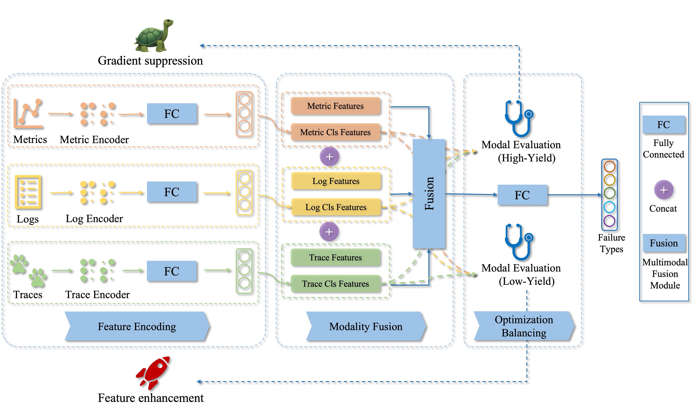

# Medicine

## A Modal-Independent Microservice Failure Diagnosis Framework Based on Multimodal Adaptive Optimization

The framework consists of three main stages: feature encoding, modality fusion, and optimization balancing. In the feature encoding stage, we design specific encoders for metrics, logs, and traces based on their characteristics. During the modality fusion stage, we use a fusion module with channel attention to combine the original statistical features and the failure classification features extracted by the encoders. In the optimization balancing stage, Medicine employs a modality evaluation component to identify high-yield and low-yield modalities, then uses a gradient suppression component to optimize high-yield modalities and a feature enhancement component to strengthen low-yield modalities.



## Description

### Folder Structure

#### Already Existing Folders
-   `./dataset`: it is used to preprocess and load data from specific path
-   `./models`: it stores models used in experiment
-   `./cache`: it stores the bert-base-uncased model used in experiment

#### Auto Generated Folders
-   `./data`: it stores the intermediary files of each preprocessed dataset
-   `./result`: it stores the result of each experiment


### File Description

-   `config.py`：the config file of D1(AIops22) and D2(GAIA)
-   `main.py`：the entry file of experiment
-   `trainer.py`：the script file of traun and test model
-   `utils.py`：the utils file

## Environment

-   Linux Server 20.04.1 LTS
-   Intel(R) Xeon(R) CPU E5-2650 v4@ 2.20GHz
-   Python version 3.9

## Getting Started

> Recommend conda environment or venv

Run the following commands in turn at bash or shell

1. `pip install -r requirements.txt`
2. `python main.py --dataset gaia` or `python main.py --dataset aiops22`

All result will be saved in `result/`

## Reproduce

1. download gaia and aiops22 dataset we provide for you
2. change dataset config in `./config.py` at the position described below:
    ```python
    gaia = {
        "dataset_dir": "path to downloaded gaia dataset entry"
    }
    aiops22 = {
        "dataset_dir": "path to downloaded aiops22 dataset entry"
    }
    ```
3. remove `./data` folder
4. run `python main.py --dataset gaia` or `python main.py --dataset aiops22`

All result will be saved in `result/`

## Some Issues

### 1. Have some trouble with downloading `bert-base-uncased` by using transformers

download pytorch version of `bert-base-uncased` from [huggingface](https://huggingface.co/google-bert/bert-base-uncased/tree/main)

then copy them into `./cache/`
